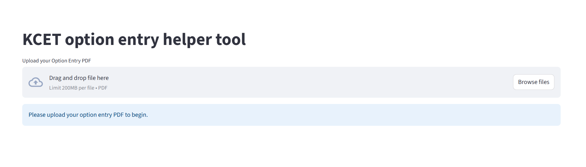
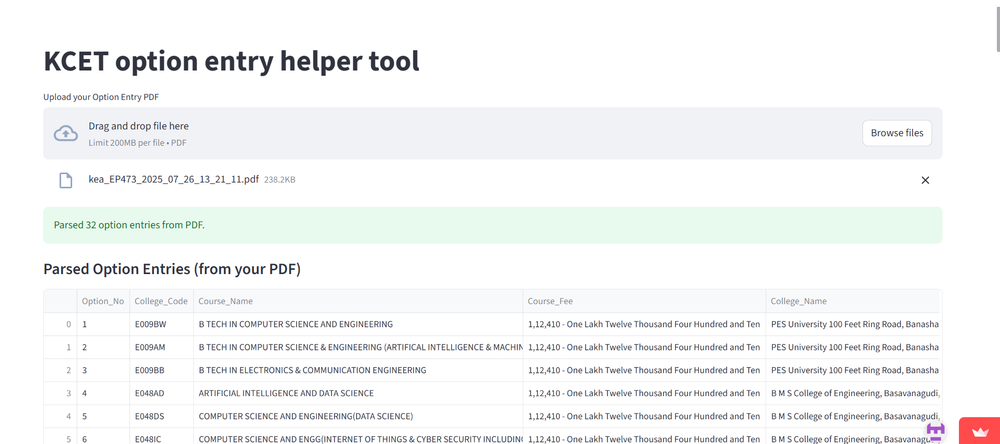
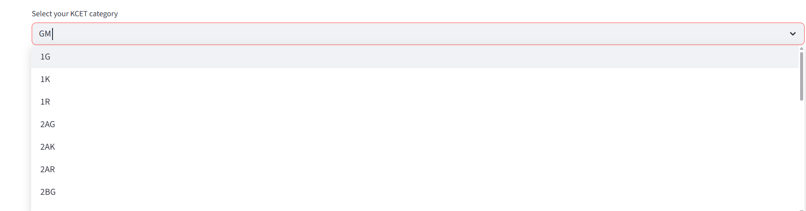
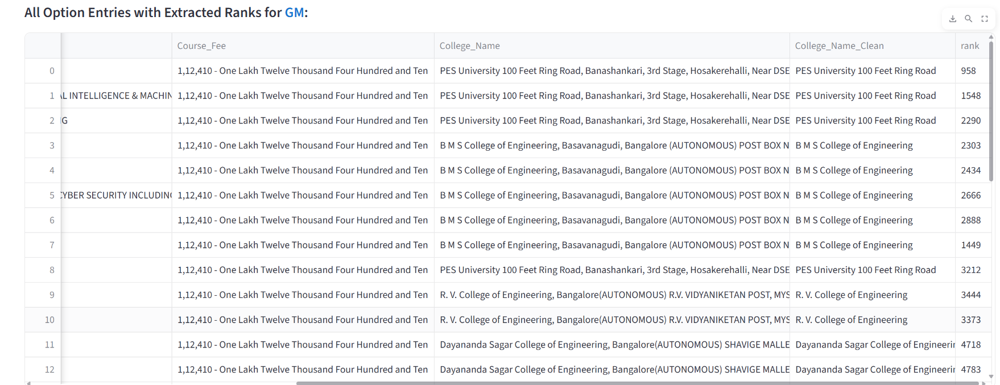
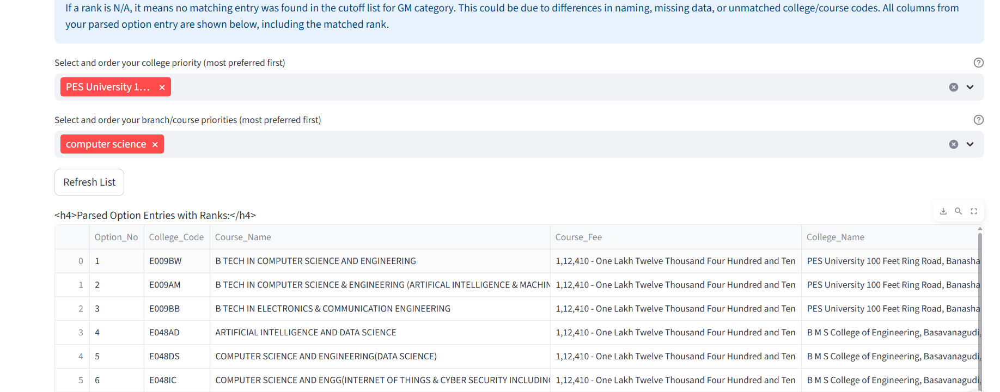
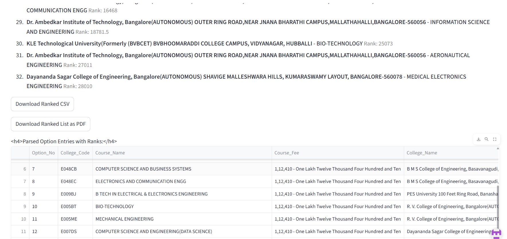

# KCET Option Entry Helper Tool
A little backstory (the wowzie part!):

So, here’s how this tool was born: My cousin was totally stressed about KCET option entry—like, scrolling through endless PDFs, trying to match colleges and cutoffs, and basically on the verge of a meltdown. She called me up, hoping for some big-brain cousin energy. And like any passionate dev (and certified problem-solver), I thought: “Why not just build a tool for this?”

Fast-forward a few late-night coding sessions (and a lot of coffee), and boom—KCET Option Entry Helper was live! Now, instead of spending hours on manual matching, you just upload your PDF and get a ranked list in seconds. If you’ve ever thought, “There’s gotta be an easier way,” this is it. Built for my cousin, shared for everyone. #GenZDev #BuiltForFam #WhyNot

A simple web app to help you quickly rank your KCET option entries with current mock cutoff 2025.

Try it live: [KCET Option Entry Tool](https://kcetoptionentrytoolgit-m7iauvpyxlxttujjh47lp6.streamlit.app/)

---

---

## How to Use

1. **Home Page**
   
   
   
   Go to the website and see the upload option.

2. **Upload your Option Entry PDF**
   
   
   
   Click the “Upload your Option Entry PDF” button and select your file.

3. **Select your KCET category**
   
   
   
   Choose your category (e.g., GM, 2AG, SCG, etc.) from the dropdown.

4. **View all extracted ranks for the selected category**
   
   
   
   Instantly see your college and branch options, with last year’s cutoff ranks for your selected category.

5. **Select priority of branch and college (mutually inclusive)**
   
   
   
   Select and order your preferred colleges and branches/courses. These priorities are mutually inclusive: for each branch in branch priority, all colleges in college priority for that branch are shown first, and vice versa.
   
   **Do not forget to hit the Refresh List button after selecting your priorities!**

6. **Download ranked list as PDF or Excel**
   
   
   
   Download your ranked list as a PDF or CSV (Excel) for easy reference.

---

## Features

- Upload your KCET option entry PDF.
- See all your options with cutoff ranks for your category.
- Set and order your college and branch preferences (mutually inclusive).
- Download your ranked list as CSV or PDF.
- 100% free and privacy-friendly.

---

## FAQ

- **Is my data safe?**  
  Yes! Your data is processed only in your browser session and not stored.

- **Who can use this?**  
  Any KCET aspirant or parent looking to simplify option entry.

---

## For Developers

To run locally:
```bash
pip install -r requirements.txt
streamlit run web/kcet_streamlit_app.py
```

---

## Screenshots

All screenshots used above are available in the `screenshots/` folder:


---
